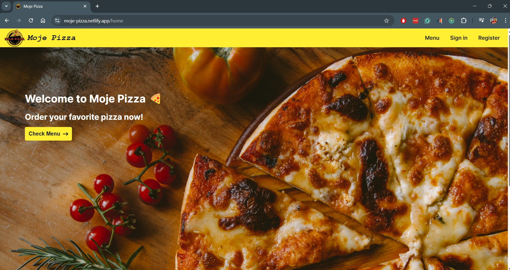
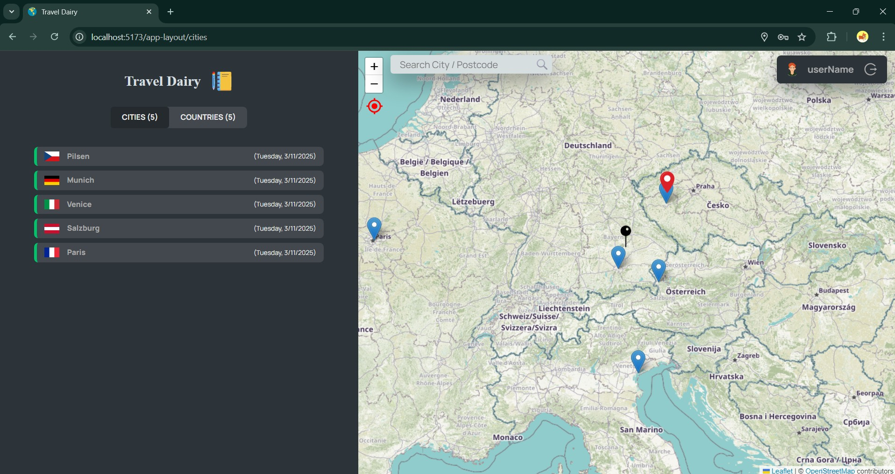

# Hi, I'm Charan Singh Sanjay

A passionate results-driven **React Developer** with 5 years of experience building scalable, high-performance web applications. I specialize in **React**, **TypeScript**, **JavaScript**, **Redux**, and modern web development, crafting intuitive and responsive UIs that enhance user experience.

## Projects (2)

These projects **demonstrate** my skills in writing **clean**, scalable, and **well-tested code**, implementing best practices in React development, and ensuring a smooth user experience with a **responsive design**.

---

1. **Moje Pizza (Online pizza ordering Web app)** - [Repository](https://github.com/charansanjay/moje-pizza) - [Live Demo](https://moje-pizza.netlify.app) **[March - 2025]** 
>Currently working on more features (OAuth, Multi language, etc..).

---

2. **Travel Diary (React Leaflet)** - [Repository](https://github.com/charansanjay/travel-diary) - [Live Demo](https://travel-diary-demo.netlify.app) **[March - 2025]** 

## Technologies I work on

    -      

   -    

   

    

    

## **💼 Looking for Opportunities!**  

**🚀 Open to Work: Frontend Developer Roles!**  

I am actively looking for opportunities as a React Developer where I can contribute my skills in React, TypeScript, Redux, and modern web development to build scalable, high-performance web applications.

If you're hiring or have exciting projects, **let's connect!**

#### Contact me: [Linkedin](https://www.linkedin.com/in/charan-singh-s-76394911b/), [Email](mailto:charan8695@gmail.com)
